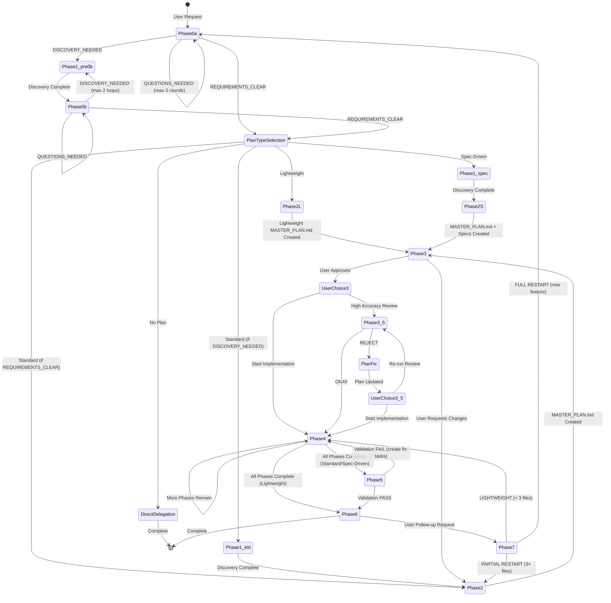
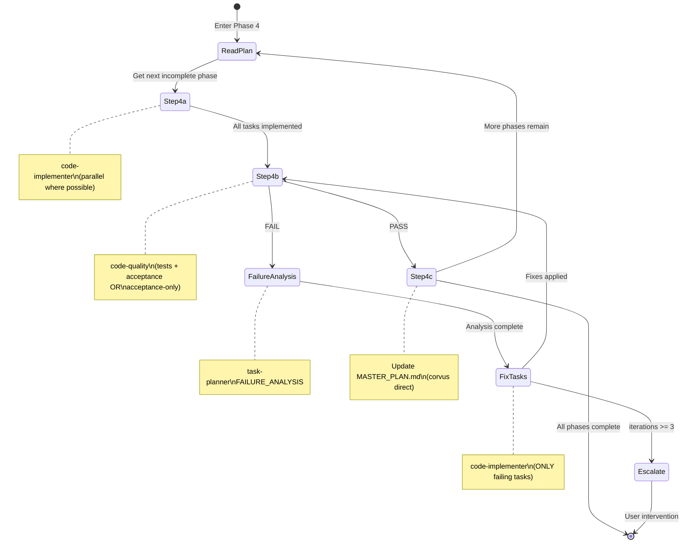
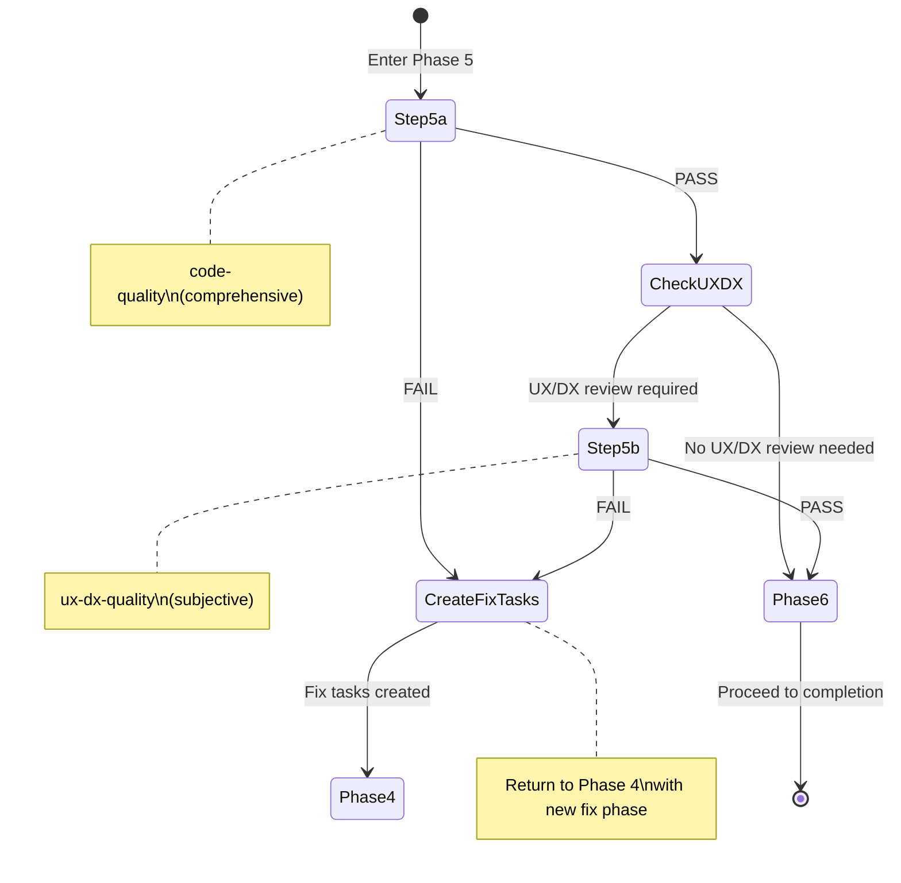
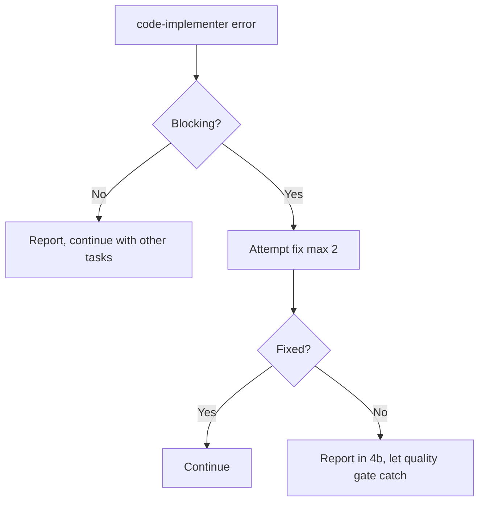
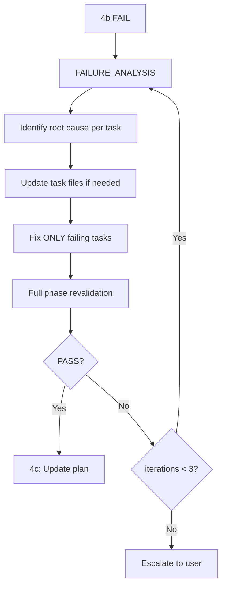
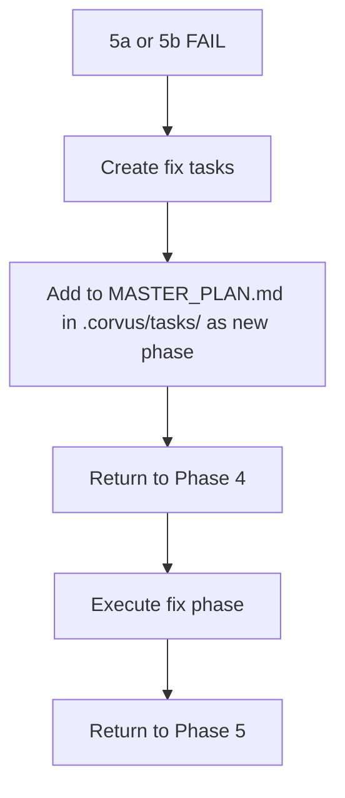

# Corvus State Machine

Complete state machine documentation for the Corvus workflow, including phase transitions, parallel execution rules, and gate enforcement.

## Overview

Corvus coordinates complex multi-step workflows through 8 phases (0-7, plus optional Phase 3.5), with a plan-type selection step between Phase 0 and Phase 2 that adapts planning depth to task complexity. Phase 3.5 provides an optional high-accuracy plan review, Phase 4 contains an implementation loop, and Phase 5 contains a two-step validation process. The state machine ensures correctness through mandatory gates, iteration limits, and structured error recovery. Plan types (No Plan, Lightweight, Standard, Spec-Driven) determine which phases are executed and which templates are used.

**Key Principles**:
- **Correctness over speed**: Every phase must complete properly before proceeding
- **Phase-level operations**: Validation happens per-phase, not per-task
- **Learning loops**: Analyze failures before fixing, extract learnings after success
- **Single approval gate**: User approval only at Phase 3

---

## Main Workflow Phases



### Phase Summary

| Phase | Name | Purpose | Agent(s) |
|-------|------|---------|----------|
| 0a | Initial Clarification | Analyze request completeness | @requirements-analyst |
| 0b | Post-Discovery Clarification | Analyze discovery findings | @requirements-analyst |
| PTS | Plan-Type Selection | Choose planning depth based on complexity | Corvus + User (Question tool) |
| 1 | Discovery | Gather context for planning | @researcher + @code-explorer (parallel) |
| 2 | Planning | Create master plan and task files | @task-planner |
| 2L | Lightweight Planning | Create simplified master plan (1 phase, 3-6 tasks) | @task-planner |
| 2S | Spec-Driven Planning | Create master plan with mandatory specs | @task-planner |
| 3 | User Approval | Single approval gate | User |
| 3.5 | High Accuracy Plan Review | Optional plan quality validation | @plan-reviewer |
| 4 | Implementation Loop | Execute phases with quality gates (tests or acceptance-only based on `tests_enabled`) | @code-implementer + @code-quality |
| 5 | Final Validation | Comprehensive objective + subjective checks (acceptance-only when `tests_enabled: false`) | @code-quality + @ux-dx-quality |
| 6 | Completion | Extract learnings, summarize | @task-planner |
| 7 | Follow-up Triage | Route follow-up requests | Corvus decision |

---

## Phase Transition Conditions

### Phase 0a Transitions

| From | To | Condition |
|------|-----|-----------|
| 0a | 0a | `QUESTIONS_NEEDED` AND round < 3 |
| 0a | Plan-Type Selection | `REQUIREMENTS_CLEAR` OR round = 3 |
| 0a | Phase 1 | `DISCOVERY_NEEDED` |

### Phase 0b Transitions

| From | To | Condition |
|------|-----|-----------|
| 0b | 0b | `QUESTIONS_NEEDED` AND total rounds < 3 |
| 0b | Plan-Type Selection | `REQUIREMENTS_CLEAR` |
| 0b | Phase 1 | `DISCOVERY_NEEDED` AND discovery iterations < 2 |
| 0b | Phase 2 | `DISCOVERY_NEEDED` AND discovery iterations >= 2 (forced) |

### Plan-Type Selection Transitions

After Phase 0a or 0b returns `REQUIREMENTS_CLEAR`, Corvus presents the plan-type recommendation (from requirements-analyst's heuristic scoring) to the user via the Question tool. The user selects one of four plan types, which determines the subsequent workflow.

| From | To | Condition |
|------|-----|-----------|
| Plan-Type Selection | Direct delegation | User selects "No Plan" |
| Plan-Type Selection | Phase 2L (Lightweight) | User selects "Lightweight" |
| Plan-Type Selection | Phase 1 | User selects "Standard" AND 0a returned DISCOVERY_NEEDED |
| Plan-Type Selection | Phase 2 | User selects "Standard" AND 0a returned REQUIREMENTS_CLEAR |
| Plan-Type Selection | Phase 1 | User selects "Spec-Driven" |

### Phase 1 Transitions

| From | To | Condition |
|------|-----|-----------|
| Phase 1 | Phase 0b | Discovery complete AND came from 0a with `DISCOVERY_NEEDED` |
| Phase 1 | Phase 0b | Additional discovery complete (from 0b loop) |

### Phase 2/2L/2S to Phase 3 Transitions

| From | To | Condition |
|------|-----|-----------|
| Phase 2 | Phase 3 | MASTER_PLAN.md exists in .corvus/tasks/ AND task files created |
| Phase 2L | Phase 3 | Lightweight MASTER_PLAN.md exists AND task files created |
| Phase 2S | Phase 3 | MASTER_PLAN.md + specs/ exist AND task files created |
| Phase 3 | User Choice | User approves plan |
| Phase 3 | Phase 2 | User requests changes to plan |

### Phase 3 → Phase 3.5/4 Transitions

| From | To | Condition |
|------|-----|-----------|
| Phase 3 | User Choice | User approves plan |
| User Choice | Phase 4 | User chooses "Start Implementation" |
| User Choice | Phase 3.5 | User chooses "High Accuracy Review" |
| Phase 3.5 | Phase 4 | plan-reviewer returns OKAY |
| Phase 3.5 | Plan Fix | plan-reviewer returns REJECT |
| Plan Fix | User Choice | task-planner fixes plan |
| User Choice (post-fix) | Phase 3.5 | User chooses "Re-run Review" |
| User Choice (post-fix) | Phase 4 | User chooses "Start Implementation" |

### Phase 4 Transitions

| From | To | Condition |
|------|-----|-----------|
| Phase 4 | Phase 4 | Current phase complete AND more phases remain |
| Phase 4 | Phase 5 | All phases in master plan complete |
| Phase 4 | User Escalation | Fix iterations >= 3 for current phase |

### Phase 5 Transitions

| From | To | Condition |
|------|-----|-----------|
| Phase 5a | Phase 5b | 5a PASS AND any task has `requires_ux_dx_review: true` |
| Phase 5a | Phase 6 | 5a PASS AND no UX/DX review required |
| Phase 5a | Phase 4 | 5a FAIL (create fix tasks) |
| Phase 5b | Phase 6 | 5b PASS |
| Phase 5b | Phase 4 | 5b FAIL (create fix tasks) |

### Phase 6-7 Transitions

| From | To | Condition |
|------|-----|-----------|
| Phase 6 | Complete | No follow-up request |
| Phase 6 | Phase 7 | User makes follow-up request |
| Phase 7 | Phase 4 | LIGHTWEIGHT path (< 3 files, clear scope) |
| Phase 7 | Phase 2 | PARTIAL RESTART (3+ files, builds on completed work) |
| Phase 7 | Phase 0a | FULL RESTART (new/unrelated feature) |

---

## Phase 4: Implementation Loop

The implementation loop is the core execution engine. It operates at the **phase level** (from MASTER_PLAN.md), not per-task.



### 4a: Implementation Step

**Agent**: @code-implementer (one per task)

**Rule**: ONE TASK = ONE CODE-IMPLEMENTER (always)

```
For each task in current phase:
  - Independent tasks: Multiple task() calls in ONE message (parallel)
  - Dependent tasks: One task() call per message (sequential)
```

**Parallel Execution Decision**:
```
Check task metadata:
  - "Parallel With" present → Can run in parallel
  - "Depends On" present → Must run after dependency
  - Same files modified → Must run sequentially
```

### 4a to 4b Transition

| Condition | Action |
|-----------|--------|
| All code-implementers return | Extract phase metadata (UX/DX flags) |
| Any code-implementer reports blocking error | Attempt fix (max 2), then escalate |
| All implementations complete | Invoke code-quality for 4b |

**Pre-4b Metadata Extraction**:
```
PHASE METADATA EXTRACTION - Phase [N]
-------------------------------------
Tasks in Phase: [NN, NN, NN]
Total Tasks: [count]

UX/DX Review Flags:
- Task NN: requires_ux_dx_review = [true/false]

Phase 5 UX/DX Required: [YES if ANY true / NO if all false]
-------------------------------------
```

### 4b: Quality Gate Step

**Agent**: @code-quality

**Checks** (when `tests_enabled: true`):
1. Run test suite (targeting phase's code)
2. Verify acceptance criteria from ALL task files
3. Check for regressions

**Checks** (when `tests_enabled: false` — acceptance-only mode):
1. Verify acceptance criteria from ALL task files (with concrete evidence)
2. Check for regressions via code review
3. Do NOT run tests or report missing tests

**NOT checked** (already done by code-implementer):
- Lint
- Type check
- Build

### 4b to 4c Transition (PASS)

| Condition | Action | When |
|-----------|--------|------|
| PHASE GATE STATUS = PASS | Proceed to 4c | Always |
| All tests pass | Continue | `tests_enabled: true` only |
| All acceptance criteria met | Continue | Always |

### 4b to Fix Cycle (FAIL)

| Condition | Action |
|-----------|--------|
| PHASE GATE STATUS = FAIL | Invoke FAILURE_ANALYSIS |
| Any test fails | Identify failing task(s) |
| Any acceptance criterion fails | Identify failing task(s) |

**Fix Cycle Flow**:
```
4b FAIL
    │
    ▼
F1: task-planner FAILURE_ANALYSIS
    │   - Root cause per failing task
    │   - Task file updates if needed
    │   - Fix instructions
    │
    ▼
F2: code-implementer (ONLY failing tasks)
    │   - Apply fixes from F1
    │   - DO NOT modify passing tasks
    │
    ▼
F3: Loop back to 4b (full phase revalidation)
    │
    ├── PASS → 4c
    └── FAIL → Check iteration count
              │
              ├── iterations < 3 → F1
              └── iterations >= 3 → Escalate to user
```

### 4c: Plan Update Step

**Agent**: Corvus (direct, no subagent)

**Actions**:
1. Mark all phase tasks as complete: `[ ]` → `[x]`
2. Update progress count
3. Update phase status
4. Reset fix_iterations = 0
5. Check for next phase

**Decision**:
- More phases remain → Loop to 4a with next phase
- All phases complete → Proceed to Phase 5

---

## Phase 5: Final Validation

Two-step validation at feature completion.



### 5a: Objective Validation

**Agent**: @code-quality

**Scope** (when `tests_enabled: true`): FULL test suite, production build, ALL acceptance criteria
**Scope** (when `tests_enabled: false`): Production build, ALL acceptance criteria (acceptance-only mode)

**Checks** (when `tests_enabled: true`):
- Run FULL test suite (not just affected tests)
- Run production build
- Verify ALL acceptance criteria from ALL task files
- Check for consistency across all changes
- Look for regressions

**Checks** (when `tests_enabled: false`):
- Run production build
- Verify ALL acceptance criteria from ALL task files (with evidence)
- Check for consistency across all changes
- Look for regressions via code review

### 5a Decision Point

| Result | UX/DX Required | Action |
|--------|----------------|--------|
| PASS | Yes (any task flagged) | Proceed to 5b |
| PASS | No | Proceed to Phase 6 |
| FAIL | - | Create fix tasks, return to Phase 4 |

### 5b: Subjective Validation

**Agent**: @ux-dx-quality

**When**: ANY task in feature had `requires_ux_dx_review: true`

**Scope**: All user-facing and developer-facing changes

**Checks**:
- Overall UX quality
- Overall DX quality
- Documentation quality
- Architectural coherence
- Pattern consistency

### 5b Decision Point

| Result | Action |
|--------|--------|
| PASS | Proceed to Phase 6 |
| FAIL | Create fix tasks, return to Phase 4 |

---

## Parallel Execution Rules

### What CAN Run in Parallel

| Scenario | Example |
|----------|---------|
| Independent tasks within a phase | Tasks 03, 04, 05 with no dependencies |
| Discovery agents in Phase 1 | @researcher + @code-explorer |
| Multiple code-implementers for independent tasks | 4 task() calls in one message |

### What CANNOT Run in Parallel

| Scenario | Reason |
|----------|--------|
| Steps within a phase (4a→4b→4c) | Sequential dependency |
| Tasks with "Depends On" metadata | Output feeds into next |
| Tasks modifying same files | Conflict risk |
| Phases in master plan | Phase order matters |
| 5a and 5b | 5b depends on 5a passing |

### Parallel Execution Patterns

**Pattern A: All Independent**
```javascript
// ONE message, FOUR parallel code-implementers
task({ subagent: "code-implementer", prompt: "Task 03..." })
task({ subagent: "code-implementer", prompt: "Task 04..." })
task({ subagent: "code-implementer", prompt: "Task 05..." })
task({ subagent: "code-implementer", prompt: "Task 06..." })
```

**Pattern B: All Sequential**
```javascript
// Message 1
task({ subagent: "code-implementer", prompt: "Task 07..." })
// Wait for completion

// Message 2
task({ subagent: "code-implementer", prompt: "Task 08..." })
// Wait for completion

// Message 3
task({ subagent: "code-implementer", prompt: "Task 09..." })
```

**Pattern C: Mixed**
```javascript
// Message 1: Parallel tasks
task({ subagent: "code-implementer", prompt: "Task 03..." })
task({ subagent: "code-implementer", prompt: "Task 04..." })
// Wait for BOTH to complete

// Message 2: Sequential task depending on 03 and 04
task({ subagent: "code-implementer", prompt: "Task 05..." })
```

---

## Gate Enforcement

Seven hard gates plus two Phase 3.5 gates that MUST be respected.

### Gate 0: After Phase 3 (User Approval)

| Allowed | Forbidden |
|---------|-----------|
| Present user choice: "Start Implementation" or "High Accuracy Review" | Skip to Phase 4 without choice |
| | Auto-run Phase 3.5 without user choosing |

### Gate 0.5: After Phase 3.5 (plan-reviewer returns)

| Allowed | Forbidden |
|---------|-----------|
| IF OKAY → Proceed to Phase 4 | Auto-proceed after REJECT |
| IF REJECT → task-planner fixes → user choice | Skip user choice after fix |
| User chooses: "Re-run Review" or "Start Implementation" | |

### Gate 1: After 4a (code-implementer returns)

| Allowed | Forbidden |
|---------|-----------|
| Invoke code-quality for 4b | Another phase |
| | Fix (no failure yet) |
| | Update plan |
| | Skip to 4c |

### Gate 2: After 4b PASS

| Allowed | Forbidden |
|---------|-----------|
| Update MASTER_PLAN.md | SUCCESS_EXTRACTION (moved to Phase 6) |
| Proceed to next phase or Phase 5 | Skip plan update |

### Gate 3: After 4b FAIL

| Allowed | Forbidden |
|---------|-----------|
| task-planner FAILURE_ANALYSIS | Fix without FAILURE_ANALYSIS |
| code-implementer fix (ONLY failing tasks) | Proceed to 4c |
| Loop back to 4b | Fix all tasks |

### Gate 4: After Phase 5 PASS

| Allowed | Forbidden |
|---------|-----------|
| Proceed to Phase 6 | Skip Phase 6 |
| | Skip SUCCESS_EXTRACTION |

### Gate 5: After 5a PASS

| Allowed | Forbidden |
|---------|-----------|
| IF `requires_ux_dx_review: true` on ANY task → 5b | Skip 5b if required |
| ELSE → Phase 6 | |

### Gate 6: After 5a FAIL

| Allowed | Forbidden |
|---------|-----------|
| Create fix tasks | Proceed to 5b |
| Return to Phase 4 | Proceed to Phase 6 |

### Gate 7: After 5b

| Allowed | Forbidden |
|---------|-----------|
| IF PASS → Phase 6 | Skip fixes if 5b fails |
| IF FAIL → fix tasks, return to Phase 4 | |

---

## Iteration Limits and Escalation

### Per-Phase Iteration Limit

**Maximum**: 3 iterations per phase through the 4a→4b fix cycle

**Tracking**:
```
fix_iterations = 0  // Reset at start of each phase

On 4b FAIL:
  fix_iterations++
  if fix_iterations >= 3:
    ESCALATE to user
  else:
    FAILURE_ANALYSIS → fix → 4b
```

### Escalation Format

```markdown
## Escalation Required

**Phase**: [N]
**Tasks**: [list]
**Iteration**: 3/3 (maximum reached)

### Failure History
| Iteration | Failure | Fix Attempted | Result |
|-----------|---------|---------------|--------|
| 1 | [description] | [fix] | FAIL |
| 2 | [description] | [fix] | FAIL |
| 3 | [description] | [fix] | FAIL |

### Root Cause Analysis
[Summary of why fixes aren't working]

### Options
1. [Option A with tradeoffs]
2. [Option B with tradeoffs]
3. Skip this phase (document as known issue)

**User decision required to proceed.**
```

### Other Iteration Limits

| Context | Limit | On Exceed |
|---------|-------|-----------|
| Phase 0a clarification rounds | 3 | Force REQUIREMENTS_CLEAR with defaults |
| Phase 0b discovery loops | 2 | Force proceed to Phase 2 |
| Phase 4 fix iterations | 3 | Escalate to user |

---

## Error Recovery Paths

### Implementation Error (4a)



### Quality Gate Failure (4b)



### Final Validation Failure (5a/5b)



---

## Quick Reference

### State Checkpoint Format

After every subagent returns during Phase 4:

```
[PHASE N | Tasks NN-MM] Step OK/FAIL -> Next | Key info
```

Examples:
```
[PHASE 1 | Tasks 01-03] 4a OK -> 4b | 3 tasks implemented
[PHASE 1 | Tasks 01-03] 4b FAIL -> F1 | Task 02 failed: test error
[PHASE 1 | Tasks 01-03] F2 OK -> 4b | Task 02 fixed, revalidating
[PHASE 1 | Tasks 01-03] 4b OK -> 4c | All tests pass
[PHASE 1 | Tasks 01-03] 4c OK -> Phase 2 | Plan updated
```

### Phase Flow Summary

```
0a ─┬─ CLEAR ──► [Plan-Type Selection] ─┬─ No Plan ──► Direct delegation
    ├─ QUESTIONS ──► 0a (loop max 3)    ├─ Lightweight ──► 2L ──► 3 ──► 4 ──► 6
    └─ DISCOVERY ──► 1 ──► 0b ──► PTS  ├─ Standard ──► (1?) ──► 2 ──► 3 ──► 4 ──► 5 ──► 6
                                        └─ Spec-Driven ──► 1 ──► 2S ──► 3 ──► 4 ──► 5 ──► 6

2/2L/2S ──► 3 (approval) ──► User Choice ─┬─► 4 (implement)
                                           └─► 3.5 (review) ─┬─ OKAY ──► 4
                                                              └─ REJECT ─► fix ──► User Choice
                                                                                    ├─► 3.5 (re-review)
                                                                                    └─► 4 (implement)

4 ──┬──► 4 (next phase)
    ├──► 5 (all complete — Standard/Spec-Driven)
    └──► 6 (all complete — Lightweight)

5a ─┬─ PASS + UX/DX ──► 5b ─┬─ PASS ──► 6
    ├─ PASS ──────────────────────────► 6
    └─ FAIL ──────────────────────────► 4 (fix)

6 ──► 7 (follow-up) ─┬─ LIGHTWEIGHT ──► 4
                     ├─ PARTIAL ──────► 2
                     └─ FULL ─────────► 0a
```

### Lightweight Plan Workflow

Lightweight plans follow a reduced workflow:
- **Skips**: Phase 1 (Discovery), Phase 5 (Final Validation), Phase 3.5 (High Accuracy Review)
- **Includes**: Phase 0 → Plan-Type Selection → Phase 2L → Phase 3 → Phase 4 → Phase 6
- Phase 4 has a single phase (no multi-phase loop)
- Uses simplified MASTER_PLAN.md template (no specs section, no risk assessment)
- Uses simplified task file templates (fewer sections, less ceremony)

### Spec-Driven Plan Workflow

Spec-Driven plans extend the Standard workflow:
- **Same as Standard**: Full Phase 0 → 1 → 2S → 3 → 4 → 5 → 6 pipeline
- **Additions**: Mandatory `specs/` directory created before task files, formal RFC 2119 language in specs, Given/When/Then acceptance criteria in task files
- Specs are reviewed alongside MASTER_PLAN.md in Phase 3

### Gate Quick Reference

| Gate | After | Allowed | Forbidden |
|------|-------|---------|-----------|
| 0 | Phase 3 approve | User choice: impl or review | Skip choice |
| 0.5 | Phase 3.5 | Phase 4 if OKAY, fix+choice if REJECT | Auto-proceed after REJECT |
| 1 | 4a | 4b | Skip, fix, other phase |
| 2 | 4b PASS | Update plan, next | SUCCESS_EXTRACTION |
| 3 | 4b FAIL | FAILURE_ANALYSIS, fix failing only | Fix without analysis |
| 4 | Phase 5 PASS | Phase 6 | Skip 6 |
| 5 | 5a PASS | 5b if required, else 6 | Skip 5b if required |
| 6 | 5a FAIL | Fix tasks, Phase 4 | Proceed to 5b/6 |
| 7 | 5b | 6 if PASS, fix if FAIL | Skip fixes |

### Validation Responsibility

| Check | When | Agent | Condition |
|-------|------|-------|-----------|
| Lint | After each file | code-implementer | Always |
| Type check | After each file | code-implementer | Always |
| Build | After implementation | code-implementer | Always |
| **Tests** | End of phase (4b) | **code-quality** | `tests_enabled: true` only |
| **Acceptance** | End of phase (4b) | **code-quality** | Always |
| Full suite | Phase 5a | code-quality | `tests_enabled: true` only |
| Acceptance (all) | Phase 5a | code-quality | Always |
| UX/DX | Phase 5b | ux-dx-quality | If required |
