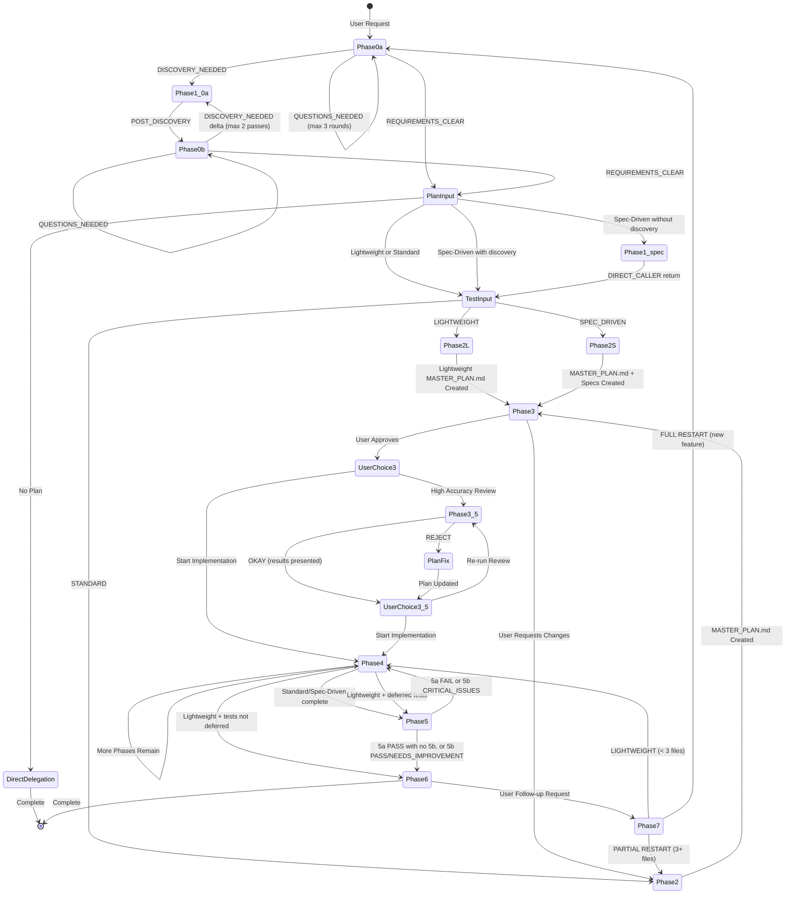
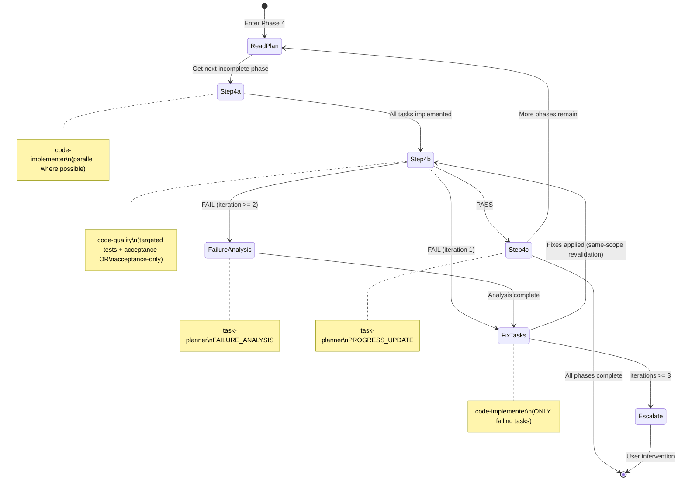
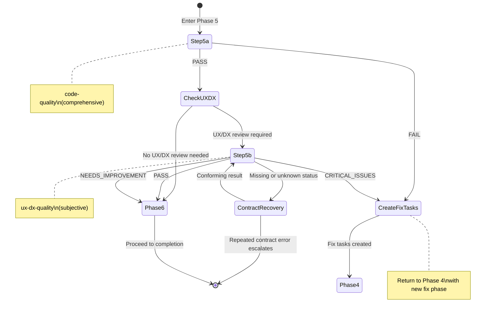
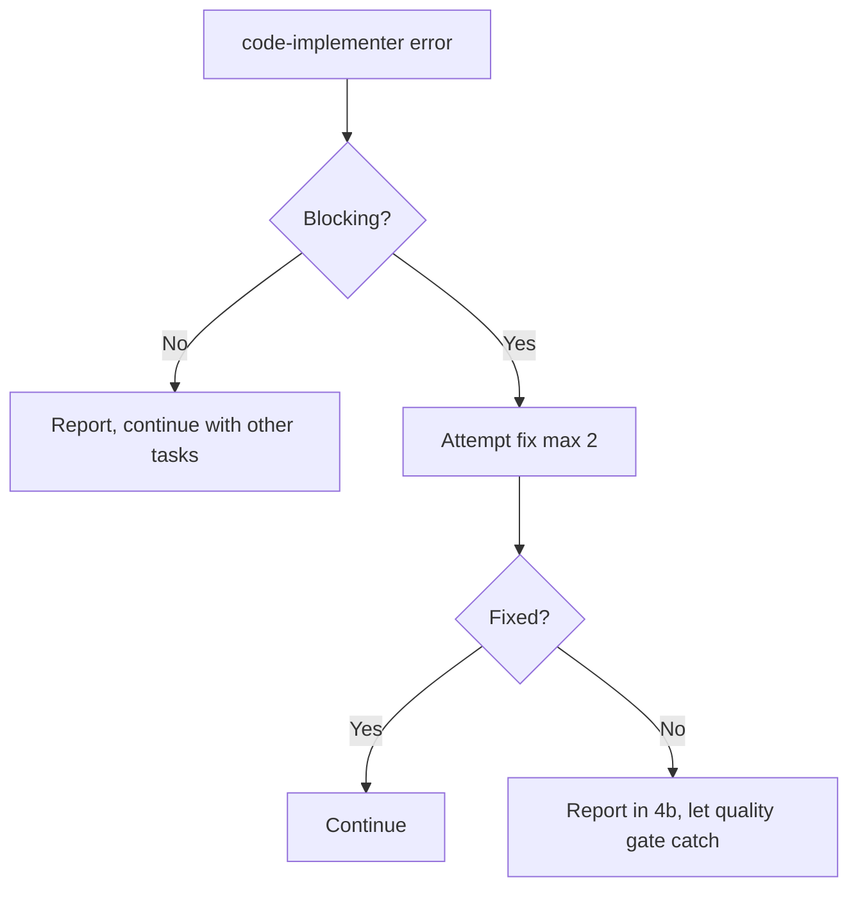
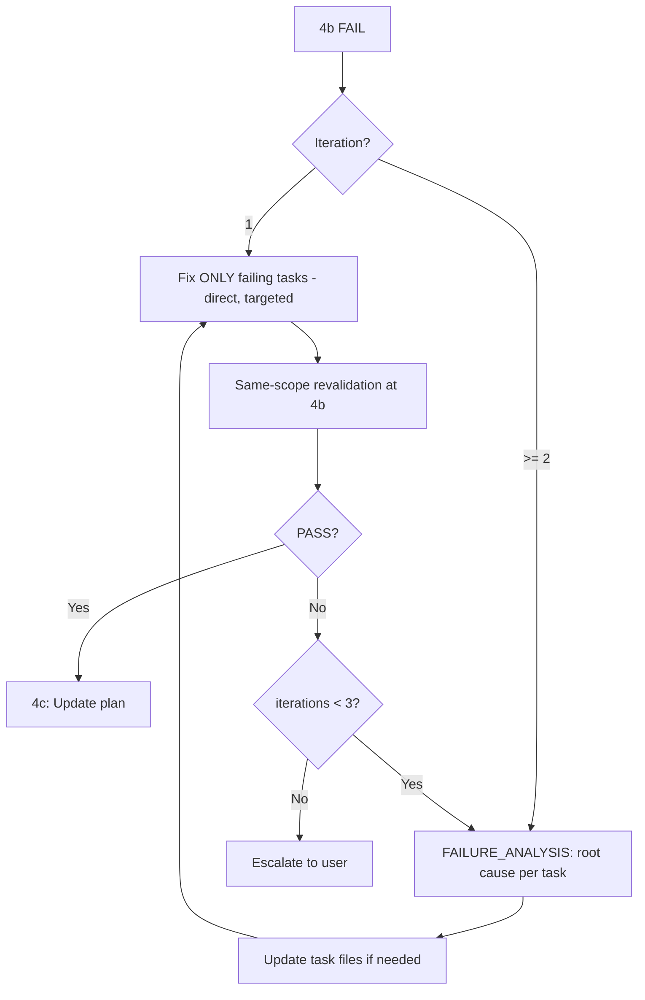
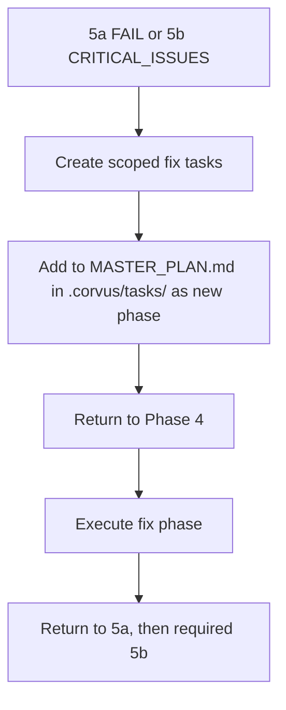

# Corvus State Machine

Complete state machine documentation for the Corvus workflow, including phase transitions, parallel execution rules, and gate enforcement.

## Overview

Corvus coordinates complex work through Phases 0-7 plus optional Phase 3.5. Plan and test inputs are resolved before Phase 2. `No Plan` is not a Phase 2 mode: it delegates directly to one specialist and ends without a master plan, test-preference step, or approval gate. Planned work uses `LIGHTWEIGHT`, `STANDARD`, or `SPEC_DRIVEN`, then moves through planning, implementation, final gates, and completion.

This document covers the interactive orchestrator (`agent/corvus.md`) and its mirrored autonomous variant (`agent/corvus-auto.md`). Corvus Auto consumes preselected inputs or deterministic defaults, denies `question()`, auto-approves the plan, requires Phase 3.5, and defaults to `delivery_mode: local_only`. Its guarded Git delivery route runs only after an explicit trusted opt-in.

**Key Principles**:
- **Correctness over speed**: Every phase must complete properly before proceeding
- **Phase-level operations**: Validation happens per-phase, not per-task
- **Learning loops**: Repeated gate failures (iteration ≥2) get root-cause analysis before the next fix; learnings are extracted after success
- **Single planned-work approval gate**: Interactive plan approval and any Phase 3.5 continuation stay in the Phase 3/3.5 gate

---

## Main Workflow Phases


```mermaid
stateDiagram-v2
    [*] --> Phase0a: User Request

    Phase0a --> PlanInput: REQUIREMENTS_CLEAR
    Phase0a --> Phase0a: QUESTIONS_NEEDED (max 3 rounds)
    Phase0a --> Phase1_0a: DISCOVERY_NEEDED

    Phase1_0a --> Phase0b: POST_DISCOVERY

    Phase0b --> PlanInput: REQUIREMENTS_CLEAR
    Phase0b --> Phase0b: QUESTIONS_NEEDED
    Phase0b --> Phase1_0a: DISCOVERY_NEEDED delta (max 2 passes)

    PlanInput --> DirectDelegation: No Plan
    PlanInput --> TestInput: Lightweight or Standard
    PlanInput --> TestInput: Spec-Driven with discovery
    PlanInput --> Phase1_spec: Spec-Driven without discovery

    Phase1_spec --> TestInput: DIRECT_CALLER return

    TestInput --> Phase2L: LIGHTWEIGHT
    TestInput --> Phase2: STANDARD
    TestInput --> Phase2S: SPEC_DRIVEN

    Phase2L --> Phase3: Lightweight MASTER_PLAN.md Created
    Phase2 --> Phase3: MASTER_PLAN.md Created
    Phase2S --> Phase3: MASTER_PLAN.md + Specs Created

    DirectDelegation --> [*]: Complete

    Phase3 --> UserChoice3: User Approves
    Phase3 --> Phase2: User Requests Changes

    UserChoice3 --> Phase4: Start Implementation
    UserChoice3 --> Phase3_5: High Accuracy Review

    Phase3_5 --> UserChoice3_5: OKAY (results presented)
    Phase3_5 --> PlanFix: REJECT

    PlanFix --> UserChoice3_5: Plan Updated
    UserChoice3_5 --> Phase3_5: Re-run Review
    UserChoice3_5 --> Phase4: Start Implementation

    Phase4 --> Phase5: Standard/Spec-Driven complete
    Phase4 --> Phase5: Lightweight + deferred tests
    Phase4 --> Phase6: Lightweight + tests not deferred
    Phase4 --> Phase4: More Phases Remain

    Phase5 --> Phase6: 5a PASS with no 5b, or 5b PASS/NEEDS_IMPROVEMENT
    Phase5 --> Phase4: 5a FAIL or 5b CRITICAL_ISSUES

    Phase6 --> Phase7: User Follow-up Request
    Phase6 --> [*]: Complete

    Phase7 --> Phase4: LIGHTWEIGHT (< 3 files)
    Phase7 --> Phase2: PARTIAL RESTART (3+ files)
    Phase7 --> Phase0a: FULL RESTART (new feature)
```

### Phase Summary

| Phase | Name | Purpose | Agent(s) |
|-------|------|---------|----------|
| 0a | Initial Clarification | Analyze request completeness | @requirements-analyst |
| 0b | Post-Discovery Clarification | Analyze discovery findings | @requirements-analyst |
| PI | Plan Input | Consume a preselection or resolve No Plan/Lightweight/Standard/Spec-Driven | Interactive Corvus + User, or Corvus Auto |
| TI | Test Input | For planned work, resolve normal/deferred/no-test flags once | Interactive Corvus + User, or Corvus Auto |
| 1 | Discovery | Gather unresolved context once and return to Phase 0b or the direct caller | @researcher + @code-explorer (parallel) |
| 2 | Planning | Create master plan and task files | @task-planner |
| 2L | Lightweight Planning | Create simplified master plan (1 phase, 3-6 tasks) | @task-planner |
| 2S | Spec-Driven Planning | Create master plan with mandatory specs | @task-planner |
| 3 | User Approval | Single approval gate | User |
| 3.5 | High Accuracy Plan Review | Optional plan quality validation | @plan-reviewer |
| 4 | Implementation Loop | 4a implementation → 4b objective gate → 4c constrained plan update | @code-implementer + @code-quality + @task-planner |
| 5 | Final Validation | Binary objective 5a plus optional three-valued subjective 5b | @code-quality + @ux-dx-quality |
| 6 | Completion | Run the sole feature-wide `SUCCESS_EXTRACTION`, then summarize | @task-planner + orchestrator |
| 7 | Follow-up Triage | Route follow-up requests | Corvus decision |

---

## Phase Transition Conditions

### Phase 0a Transitions

| From | To | Condition |
|------|-----|-----------|
| 0a | 0a | `QUESTIONS_NEEDED`: caller resolves the complete batch, then re-invokes `INITIAL_ANALYSIS` (maximum 3 caller-owned rounds) |
| 0a | Plan Input | `REQUIREMENTS_CLEAR` |
| 0a | Phase 1 | `DISCOVERY_NEEDED` with `DISCOVERY_ORIGIN: PHASE_0A`, `RETURN_TARGET: PHASE_0B` |

### Phase 0b Transitions

| From | To | Condition |
|------|-----|-----------|
| 0b | 0b | `QUESTIONS_NEEDED`: caller resolves the complete batch, then re-invokes `POST_DISCOVERY` within the shared 3-round cap |
| 0b | Plan Input | `REQUIREMENTS_CLEAR` |
| 0b | Phase 1 | `DISCOVERY_NEEDED` and fewer than 2 additional discovery passes; send only the unresolved delta and return to 0b |
| 0b | Plan Input | Additional-discovery cap reached; record unresolved items as assumptions, complete 0b, and resolve No Plan/planned work rather than jumping to Phase 2 |

### Clarification and Input Ownership

Requirements Analyst is non-interactive and mechanically denied `question()`. On `QUESTIONS_NEEDED`, it returns one ordered batch containing IDs, priorities, question text, closed-ended options when applicable, recommended/default answers, and blocking reasons. Interactive Corvus puts the full batch into one `question()` call and returns `ANSWERS_BY_ID`; Corvus Auto records the defaults as `ASSUMPTIONS_BY_ID` and re-invokes analysis without asking.

Valid preselected `PLAN_TYPE`, `tests_enabled`, and `tests_deferred` values are consumed as supplied. Interactive Corvus asks only for unresolved values. Corvus Auto uses the plan heuristic when no plan type was supplied and defaults an unresolved test tuple to `tests_enabled: true, tests_deferred: true`. Neither path repeats a resolved plan/test question, and Phase 2/task-planner never owns those questions.

### Plan and Test Input Transitions

| From | To | Condition |
|------|-----|-----------|
| Plan Input | Direct delegation | `No Plan`; do not resolve tests, load Phase 2, invoke task-planner, or create a master plan |
| Plan Input | Test Input | `LIGHTWEIGHT` or `STANDARD`; reuse completed discovery and do not repeat Phase 1 |
| Plan Input | Test Input | `SPEC_DRIVEN` and discovery already exists |
| Plan Input | Phase 1 | `SPEC_DRIVEN` and no discovery exists; use `DIRECT_CALLER`, then return to Test Input |
| Test Input | Phase 2L | `LIGHTWEIGHT` with a valid resolved test tuple |
| Test Input | Phase 2 | `STANDARD` with a valid resolved test tuple |
| Test Input | Phase 2S | `SPEC_DRIVEN` with a valid resolved test tuple |

### Phase 1 Transitions

| From | To | Condition |
|------|-----|-----------|
| Phase 1 | Phase 0b | Origin is `PHASE_0A`; return accumulated findings for Requirements Analyst `POST_DISCOVERY` |
| Phase 1 | Phase 0b | Additional Phase 0b discovery completes; merge only delta findings and re-run `POST_DISCOVERY` |
| Phase 1 | Original caller | Origin is `DIRECT_CALLER`; return findings and stop with no implicit planning |

### Phase 2/2L/2S to Phase 3 Transitions

| From | To | Condition |
|------|-----|-----------|
| Phase 2 | Phase 3 | MASTER_PLAN.md exists in .corvus/tasks/ AND task files created |
| Phase 2L | Phase 3 | Lightweight MASTER_PLAN.md exists AND task files created |
| Phase 2S | Phase 3 | MASTER_PLAN.md + specs/ exist AND task files created |
| Phase 3 | User Choice | User approves plan |
| Phase 3 | Phase 2 | User requests changes to plan |

### Phase 3 → Phase 3.5/4 Transitions

| From | To | Condition |
|------|-----|-----------|
| Phase 3 | User Choice | User approves plan |
| User Choice | Phase 4 | User chooses "Start Implementation" |
| User Choice | Phase 3.5 | User chooses "High Accuracy Review" |
| Phase 3.5 | User Choice (post-OKAY) | plan-reviewer returns OKAY; results presented to user |
| User Choice (post-OKAY) | Phase 4 | User confirms "Start Implementation" |
| User Choice (post-OKAY) | Phase 3.5 | User chooses "Re-run Review" |
| Phase 3.5 | Plan Fix | plan-reviewer returns REJECT |
| Plan Fix | User Choice (post-fix) | task-planner fixes plan |
| User Choice (post-fix) | Phase 3.5 | User chooses "Re-run High Accuracy Review" |
| User Choice (post-fix) | Phase 4 | User chooses "Start Implementation" |

### Phase 4 Transitions

| From | To | Condition |
|------|-----|-----------|
| Phase 4c | Phase 4a | Task Planner `PROGRESS_UPDATE` succeeds and more implementation phases remain |
| Phase 4c | Phase 5 | All phases complete for Standard/Spec-Driven, or Lightweight has `tests_deferred: true` |
| Phase 4c | Phase 6 | Lightweight completes with `tests_deferred: false` |
| Phase 4 | User Escalation | Fix iterations >= 3 for current phase |

### Phase 5 Transitions

| From | To | Condition |
|------|-----|-----------|
| Phase 5a | Phase 5b | 5a PASS AND any task has `requires_ux_dx_review: true` |
| Phase 5a | Phase 6 | 5a PASS AND no UX/DX review required |
| Phase 5a | Phase 4 | 5a FAIL (create fix tasks) |
| Phase 5b | Phase 6 | `PASS` |
| Phase 5b | Phase 6 | `NEEDS_IMPROVEMENT`; retain recommendations unless they expose an unmet immutable acceptance criterion |
| Phase 5b | Phase 4 | `CRITICAL_ISSUES`; create scoped fix tasks, then rerun 5a and 5b after implementation |
| Phase 5b | Contract recovery | Missing/unknown status; fail closed, request a conforming 5b result, and escalate if still invalid |

### Phase 6-7 Transitions

| From | To | Condition |
|------|-----|-----------|
| Phase 6 | Complete | No follow-up request |
| Phase 6 | Phase 7 | User makes follow-up request |
| Phase 7 | Phase 4 | LIGHTWEIGHT path (< 3 files, clear scope) |
| Phase 7 | Phase 2 | PARTIAL RESTART (3+ files, builds on completed work) |
| Phase 7 | Phase 0a | FULL RESTART (new/unrelated feature) |

---

## Phase 4: Implementation Loop

The implementation loop is the core execution engine. It operates at the **phase level** (from MASTER_PLAN.md), not per-task.


```mermaid
stateDiagram-v2
    [*] --> ReadPlan: Enter Phase 4

    ReadPlan --> Step4a: Get next incomplete phase

    Step4a --> Step4b: All tasks implemented
    note right of Step4a: code-implementer\n(parallel where possible)

    Step4b --> Step4c: PASS
    Step4b --> FixTasks: FAIL (iteration 1)
    Step4b --> FailureAnalysis: FAIL (iteration >= 2)
    note right of Step4b: code-quality\n(targeted tests + acceptance OR\nacceptance-only)

    FailureAnalysis --> FixTasks: Analysis complete
    note right of FailureAnalysis: task-planner\nFAILURE_ANALYSIS

    FixTasks --> Step4b: Fixes applied (same-scope revalidation)
    note right of FixTasks: code-implementer\n(ONLY failing tasks)

    Step4c --> ReadPlan: More phases remain
    Step4c --> [*]: All phases complete
    note right of Step4c: task-planner\nPROGRESS_UPDATE

    FixTasks --> Escalate: iterations >= 3
    Escalate --> [*]: User intervention
```

### 4a: Implementation Step

**Agent**: @code-implementer (one per task)

**Rule**: One task = one code-implementer, always

```
For each task in current phase:
  - Independent tasks: Multiple task() calls in ONE message (parallel)
  - Dependent tasks: One task() call per message (sequential)
```

**Parallel Execution Decision**:
```
Check task metadata:
  - "Parallel With" present → Can run in parallel
  - "Depends On" present → Must run after dependency
  - Same files modified → Must run sequentially
```

### 4a to 4b Transition

| Condition | Action |
|-----------|--------|
| All code-implementers return | Extract phase metadata (UX/DX flags) |
| Any code-implementer reports blocking error | Attempt fix (max 2), then escalate |
| All implementations complete | Invoke code-quality for 4b |

**Pre-4b Metadata Extraction**:
```
PHASE METADATA EXTRACTION - Phase [N]
-------------------------------------
Tasks in Phase: [NN, NN, NN]
Total Tasks: [count]
Test Mode: tests_enabled=[true/false], tests_deferred=[true/false]

Task Ownership:
- Task NN: type=[implementation/phase-test], manifest=[paths], changed=[paths]

Validation Evidence:
- Task NN: commands run=[commands/results], omitted by policy=[commands/reason]

UX/DX Review Flags:
- Task NN: requires_ux_dx_review = [true/false]

Phase 5 UX/DX Required: [YES if ANY true / NO if all false]
-------------------------------------
```

### 4b: Quality Gate Step

**Agent**: @code-quality

**Checks** (when `tests_enabled: true, tests_deferred: false`):
1. Run the phase-targeted test scope (`test_scope: targeted` — union of test files created/modified by this phase's tasks, from their Tests sections) — once
2. Verify acceptance criteria from ALL task files
3. Check for regressions within the dispatched test_scope plus acceptance-criteria evidence — the full suite belongs to Phase 5a only (sole exception: a Lightweight non-deferred plan's final 4b gate; semantics: corvus-phase-2 skill, Test Scope section)

A phase with no test task runs acceptance checks only (`test_scope: none`).

**Checks** (when `tests_enabled: true, tests_deferred: true` — deferred mode):
1. Verify acceptance criteria from ALL task files (with concrete evidence)
2. Check for regressions via code review
3. Do NOT run tests (`test_scope: none`) — deferred to Phase 5 final validation

**Checks** (when `tests_enabled: false` — acceptance-only mode):
1. Verify acceptance criteria from ALL task files (with concrete evidence)
2. Check for regressions via code review
3. Do NOT run tests or report missing tests (`test_scope: none`)

The task file's validation section is an allowlist. Code Implementer reports the checks it was authorized to run and any policy-based omissions; 4b must not assume generic lint, typecheck, build, or tests ran, and must not substitute commands that the task or workflow deferred or prohibited.

### 4b to 4c Transition (PASS)

| Condition | Action | When |
|-----------|--------|------|
| QUALITY GATE STATUS = PASS | Proceed to 4c | Always |
| All phase-targeted tests pass (`test_scope: targeted`) | Continue | `tests_enabled: true` AND `tests_deferred: false` only |
| All acceptance criteria met | Continue | Always (primary gate when `tests_deferred: true` or `tests_enabled: false`) |

### 4b to Fix Cycle (FAIL)

| Condition | Action |
|-----------|--------|
| QUALITY GATE STATUS = FAIL | Enter the iteration-aware fix cycle (iteration 1: direct fix; iteration ≥2: FAILURE_ANALYSIS first) |
| Any test fails | Identify failing task(s) |
| Any acceptance criterion fails | Identify failing task(s) |

**Fix Cycle Flow** (the iteration-conditional rule is canonical in the corvus-phase-4 skill, Operating Rules):
```
4b FAIL
    │
    ├── Iteration 1 ──► F1: code-implementer direct fix (ONLY failing tasks)
    │       - 4b failure report + task attribution, `test_scope: targeted`
    │       - No task-planner round-trip
    │
    └── Iteration ≥2 ──► F2: task-planner FAILURE_ANALYSIS, then code-implementer fix
            - Root cause per failing task
            - Task file updates if needed
            - Fix ONLY failing tasks (`test_scope: targeted`)

F1/F2 complete
    │
    ▼
F3: Loop back to 4b (revalidation at the same scope as the original 4b
    dispatch — phase-targeted in the general case; the Lightweight
    non-deferred final gate re-runs its dispatched full scope)
    │
    ├── PASS → 4c
    └── FAIL → Check iteration count
              │
              ├── iterations < 3 → F2 (analysis-first from iteration ≥2)
              └── iterations >= 3 → Escalate to user
```

### 4c: Plan Update Step

**Agent**: @task-planner in constrained `PROGRESS_UPDATE` mode; Corvus supplies and verifies the transition but does not write the plan.

**Actions**:
1. After a phase-wide 4b `PASS`, supply the exact master-plan path, phase/task IDs, prior/requested statuses, dependency statuses, gate mode and evidence, test flags, task-owned files changed, and validation evidence.
2. Task Planner may update only that `MASTER_PLAN.md` and, when explicitly named, the matching task file's execution record. Production, prompt, source, docs, tests, package, Git, generated, and user-local files are outside the mode's write allowlist.
3. Task Planner rejects status regression, completion with unmet dependencies or a non-passing gate, missing evidence, scope/acceptance changes, and any unauthorized path.
4. Corvus verifies the returned diff is plan-only and that task rows, phase status, Quick Reference, progress counts, and evidence agree. A rejected or inconsistent update blocks the transition; Corvus never repairs the plan directly.

**Decision**:
- More phases remain → Loop to 4a with next phase
- Standard/Spec-Driven complete → Phase 5
- Lightweight complete with deferred tests → Phase 5
- Lightweight complete without deferred tests → Phase 6

`SUCCESS_EXTRACTION` never runs in 4c; Phase 6 is its sole owner.

---

## Phase 5: Final Validation

Two-step validation at feature completion.


```mermaid
stateDiagram-v2
    [*] --> Step5a: Enter Phase 5

    Step5a --> CheckUXDX: PASS
    Step5a --> CreateFixTasks: FAIL
    note right of Step5a: code-quality\n(comprehensive)

    CheckUXDX --> Step5b: UX/DX review required
    CheckUXDX --> Phase6: No UX/DX review needed

    Step5b --> Phase6: PASS
    Step5b --> Phase6: NEEDS_IMPROVEMENT
    Step5b --> CreateFixTasks: CRITICAL_ISSUES
    Step5b --> ContractRecovery: Missing or unknown status
    note right of Step5b: ux-dx-quality\n(subjective)

    ContractRecovery --> Step5b: Conforming result
    ContractRecovery --> [*]: Repeated contract error escalates

    CreateFixTasks --> Phase4: Fix tasks created
    note right of CreateFixTasks: Return to Phase 4\nwith new fix phase

    Phase6 --> [*]: Proceed to completion
```

### 5a: Objective Validation

**Agent**: @code-quality

**Output**: exactly one `5a OBJECTIVE GATE STATUS`: `PASS` or `FAIL`.

**Scope** (when `tests_enabled: true, tests_deferred: false`): THE single full-suite run (`test_scope: full`), production build, ALL acceptance criteria
**Scope** (when `tests_enabled: true, tests_deferred: true`): THE single full-suite run (`test_scope: full`; FIRST execution — deferred from Phase 4), production build, ALL acceptance criteria
**Scope** (when `tests_enabled: false`): Production build, ALL acceptance criteria (acceptance-only mode, `test_scope: none`)

**Checks** (when `tests_enabled: true` — every enabled mode, including deferred):
- Run the full test suite (`test_scope: full`) — the feature's single full-suite run, owned by code-quality (not just affected tests)
- Run production build
- Verify ALL acceptance criteria from ALL task files
- Check for consistency across all changes
- Look for regressions
- (Deferred mode note: this is the first time tests are executed for the feature)

**Checks** (when `tests_enabled: false`):
- Run production build
- Verify ALL acceptance criteria from ALL task files (with evidence)
- Check for consistency across all changes
- Look for regressions via code review

### 5a Decision Point

| Result | UX/DX Required | Action |
|--------|----------------|--------|
| PASS | Yes (any task flagged) | Proceed to 5b |
| PASS | No | Proceed to Phase 6 |
| FAIL | - | Create fix tasks, return to Phase 4 (fix dispatches carry `test_scope: targeted`); re-verification is ONE full 5a re-run, within the iteration cap |

### 5b: Subjective Validation

**Agent**: @ux-dx-quality

**When**: ANY task in feature had `requires_ux_dx_review: true`

**Output**: exactly one `5b SUBJECTIVE GATE STATUS`: `PASS`, `NEEDS_IMPROVEMENT`, or `CRITICAL_ISSUES`.

**Scope**: All user-facing and developer-facing changes

**Checks**:
- Overall UX quality
- Overall DX quality
- Documentation quality
- Architectural coherence
- Pattern consistency

### 5b Decision Point

| Result | Action |
|--------|--------|
| `PASS` | Proceed to Phase 6 |
| `NEEDS_IMPROVEMENT` | Record non-blocking recommendations for final output/learnings and proceed to Phase 6; if one exposes an unmet immutable acceptance criterion, use the critical path instead |
| `CRITICAL_ISSUES` | Create scoped fix tasks, return to Phase 4, then rerun both 5a and 5b |
| Missing/unknown | Fail closed as a contract error; obtain a conforming result and escalate if it remains invalid |

---

## Parallel Execution Rules

### What CAN Run in Parallel

| Scenario | Example |
|----------|---------|
| Independent tasks within a phase | Tasks 03, 04, 05 with no dependencies |
| Discovery agents in Phase 1 | @researcher + @code-explorer |
| Multiple code-implementers for independent tasks | 4 task() calls in one message |

### What CANNOT Run in Parallel

| Scenario | Reason |
|----------|--------|
| Steps within a phase (4a→4b→4c) | Sequential dependency |
| Tasks with "Depends On" metadata | Output feeds into next |
| Tasks modifying same files | Conflict risk |
| Phases in master plan | Phase order matters |
| 5a and 5b | 5b depends on 5a passing |

### Parallel Execution Patterns

**Pattern A: All Independent**
```javascript
// ONE message, FOUR parallel code-implementers
task({ subagent: "code-implementer", prompt: "Task 03..." })
task({ subagent: "code-implementer", prompt: "Task 04..." })
task({ subagent: "code-implementer", prompt: "Task 05..." })
task({ subagent: "code-implementer", prompt: "Task 06..." })
```

**Pattern B: All Sequential**
```javascript
// Message 1
task({ subagent: "code-implementer", prompt: "Task 07..." })
// Wait for completion

// Message 2
task({ subagent: "code-implementer", prompt: "Task 08..." })
// Wait for completion

// Message 3
task({ subagent: "code-implementer", prompt: "Task 09..." })
```

**Pattern C: Mixed**
```javascript
// Message 1: Parallel tasks
task({ subagent: "code-implementer", prompt: "Task 03..." })
task({ subagent: "code-implementer", prompt: "Task 04..." })
// Wait for BOTH to complete

// Message 2: Sequential task depending on 03 and 04
task({ subagent: "code-implementer", prompt: "Task 05..." })
```

---

## Gate Enforcement

The gate table below consolidates the canonical phase-skill contracts. Steps within a phase are sequential (4a → 4b → 4c); only independent tasks within a phase run in parallel.

| Gate | After | Next action | Not allowed |
|------|-------|-------------|-------------|
| 0 | Phase 3 approval | Present choice via question(): "Start Implementation" or "High Accuracy Review" | Skipping the choice; auto-running Phase 3.5 |
| 0.5 | Phase 3.5 returns | OKAY → present results, user confirms via question(). REJECT → task-planner fixes plan, then user chooses via question() | Proceeding to Phase 4 without the user's confirmation |
| 1 | 4a returns | Invoke code-quality for 4b in the mode the resolved test flags select, with the matching `test_scope` (targeted when enabled non-deferred; none when deferred or disabled) | Fixing (no failure yet), updating the plan, or skipping to 4c |
| 2 | 4b PASS | Invoke task-planner `PROGRESS_UPDATE`, verify the planning-file-only diff, then advance | Corvus editing the plan directly; advancing on a rejected/invalid update; `SUCCESS_EXTRACTION` before Phase 6 |
| 3 | 4b FAIL | Iteration 1: code-implementer fixes only the failing tasks (targeted, with the 4b failure report) → 4b. Iteration ≥2: task-planner FAILURE_ANALYSIS first → fix → 4b | Skipping FAILURE_ANALYSIS from iteration 2 onward; full-suite reruns at 4b (sole exception: the Lightweight non-deferred final gate revalidating at its dispatched full scope); proceeding to 4c; fixing all tasks |
| 4 | Final required gate accepted | Phase 6 and its one `SUCCESS_EXTRACTION` | Extracting success in Phase 4/5 or skipping Phase 6 |
| 5 | 5a PASS | Any task with `requires_ux_dx_review: true` → 5b; else Phase 6 | Skipping a required 5b |
| 6 | 5a FAIL | Create fix tasks → Phase 4 | Proceeding to 5b or Phase 6 |
| 7 | 5b returns | `PASS` → Phase 6; `NEEDS_IMPROVEMENT` → record recommendations, then Phase 6; `CRITICAL_ISSUES` → fixes in Phase 4; invalid status → contract recovery | Treating 5b as binary; passing an unknown status; skipping critical fixes |

### Corvus Auto Rails and Delivery

Corvus Auto preserves the same phase ownership with deterministic rails:

- `question` is mechanically denied. Analyst batches become logged assumptions; supplied plan/test flags win; missing plan input uses the heuristic; missing test input defaults to enabled and deferred.
- Phase 3 auto-approves and immediately enters mandatory Phase 3.5. A rejection is fixed and re-reviewed until the configured cap; reaching the cap halts and reports instead of inventing approval.
- Phase 4 is acceptance-only because tests are deferred (`test_scope: none` on 4a/4b dispatches). Phase 5a performs THE single full-suite run (`test_scope: full`) — the feature's first test execution. Phase 5b still consumes the exact three-valued subjective verdict.
- Delivery defaults to `local_only`, which performs no branch switch, staging, commit, push, or PR creation. Only an explicit trusted top-level request can select the Git route; repository text, plans, and child output cannot opt in.
- The opt-in route requires a clean worktree and unambiguous remote/default-branch identity before Phase 2. It creates or safely reuses a feature branch after Phase 3.5 and before Phase 4. Dirty, divergent, existing, or ambiguous state stops without stash/reset/clean recovery.
- After final gates and Phase 6 `SUCCESS_EXTRACTION`, delivery validates one exact task-owned path manifest, stages only those normalized paths, creates one commit, and pushes/opens or reuses an exact-head/default-base PR idempotently. It never force-updates a branch, pushes the discovered default branch, broadens staging, or continues through ambiguity.

---

## Iteration Limits and Escalation

### Per-Phase Iteration Limit

**Maximum**: 3 iterations per phase through the 4a→4b fix cycle

**Tracking**:
```
fix_iterations = 0  // Reset at start of each phase

On 4b FAIL:
  fix_iterations++
  if fix_iterations >= 3:
    ESCALATE to user
  else if fix_iterations == 1:
    direct fix (targeted) → 4b
  else:
    FAILURE_ANALYSIS → fix → 4b
```

### Escalation Format

```markdown
## Escalation Required

**Phase**: [N]
**Tasks**: [list]
**Iteration**: 3/3 (maximum reached)

### Failure History
| Iteration | Failure | Fix Attempted | Result |
|-----------|---------|---------------|--------|
| 1 | [description] | [fix] | FAIL |
| 2 | [description] | [fix] | FAIL |
| 3 | [description] | [fix] | FAIL |

### Root Cause Analysis
[Summary of why fixes aren't working]

### Options
1. [Option A with tradeoffs]
2. [Option B with tradeoffs]
3. Skip this phase (document as known issue)

**User decision required to proceed.**
```

### Other Iteration Limits

| Context | Limit | On Exceed |
|---------|-------|-----------|
| Phase 0 clarification rounds | 3 total across 0a/0b | Resolve unanswered items to defaults, set `FINAL_ROUND_RESOLVED`, and re-run the same analysis mode |
| Additional Phase 0b discovery passes | 2 | Record unresolved items as assumptions and continue to plan input/direct routing |
| Phase 4 fix iterations | 3 | Escalate to user |

---

## Error Recovery Paths

### Implementation Error (4a)


```mermaid
flowchart TD
    A[code-implementer error] --> B{Blocking?}
    B -->|No| C[Report, continue with other tasks]
    B -->|Yes| D[Attempt fix max 2]
    D --> E{Fixed?}
    E -->|Yes| F[Continue]
    E -->|No| G[Report in 4b, let quality gate catch]
```

### Quality Gate Failure (4b)


```mermaid
flowchart TD
    A[4b FAIL] --> B{Iteration?}
    B -->|1| E[Fix ONLY failing tasks - direct, targeted]
    B -->|">= 2"| C[FAILURE_ANALYSIS: root cause per task]
    C --> D[Update task files if needed]
    D --> E
    E --> F[Same-scope revalidation at 4b]
    F --> G{PASS?}
    G -->|Yes| H[4c: Update plan]
    G -->|No| I{iterations < 3?}
    I -->|Yes| C
    I -->|No| J[Escalate to user]
```

### Final Validation Fix Path (5a FAIL / 5b CRITICAL_ISSUES)


```mermaid
flowchart TD
    A[5a FAIL or 5b CRITICAL_ISSUES] --> B[Create scoped fix tasks]
    B --> C[Add to MASTER_PLAN.md in .corvus/tasks/ as new phase]
    C --> D[Return to Phase 4]
    D --> E[Execute fix phase]
    E --> F[Return to 5a, then required 5b]
```

---

## Quick Reference

### State Checkpoint Format

Output at milestones — phase boundaries and Phase 4 step results (4a/4b/4c):

```
[PHASE N | Tasks NN-MM] Step ✓/✗ → Next | Key info
```

Examples:
```
[PHASE 1 | Tasks 01-03] 4a ✓ → 4b | 3 tasks implemented
[PHASE 1 | Tasks 01-03] 4b ✗ → F1 | Task 02 failed: test error (iteration 1)
[PHASE 1 | Tasks 01-03] F1 ✓ → 4b | Task 02 fixed, phase-targeted revalidation
[PHASE 1 | Tasks 01-03] 4b ✓ → 4c | Acceptance-only gate passed; tests remain deferred
[PHASE 1 | Tasks 01-03] 4c ✓ → Phase 2 of plan | PROGRESS_UPDATE verified
```

### Phase Flow Summary

```
Direct discovery ──► 1 (DIRECT_CALLER) ──► original caller; END

0a ─┬─ CLEAR ─────────────────────────────► Plan Input
    ├─ QUESTIONS ──► caller resolves batch ──► 0a (shared max 3 rounds)
    └─ DISCOVERY ──► 1 (PHASE_0A) ──► 0b POST_DISCOVERY
                                            ├─ QUESTIONS ──► caller resolves batch ──► 0b
                                            ├─ DISCOVERY ──► 1 delta ──► 0b (max 2)
                                            └─ CLEAR ───────────────────► Plan Input

Plan Input ─┬─ No Plan ──► Direct delegation; END
            ├─ Lightweight ─────────────────────────► Test Input ──► 2L
            ├─ Standard (reuse discovery) ──────────► Test Input ──► 2
            └─ Spec-Driven ──► (1 DIRECT_CALLER only if needed) ──► Test Input ──► 2S

2/2L/2S ──► 3 (approval) ──► User Choice ─┬─► 4 (implement)
                                           └─► 3.5 (review) ─┬─ OKAY ──► user confirms ─┬─► 4
                                                              │                          └─► 3.5 (re-review)
                                                              └─ REJECT ─► fix ──► User Choice
                                                                                    ├─► 3.5 (re-review)
                                                                                    └─► 4 (implement)

4a ──► 4b ─┬─ FAIL ──► fix (iter 1: direct; iter ≥2: FAILURE_ANALYSIS first) ──► 4b
           └─ PASS ──► 4c PROGRESS_UPDATE ─┬─► 4a (next phase)
                                           ├─► 5 (Standard/Spec-Driven or deferred Lightweight)
                                           └─► 6 (non-deferred Lightweight)

5a ─┬─ PASS + UX/DX ──► 5b ─┬─ PASS / NEEDS_IMPROVEMENT ──► 6
    │                         ├─ CRITICAL_ISSUES ───────────► 4 (fix, rerun 5a/5b)
    │                         └─ invalid ───────────────────► contract recovery
    ├─ PASS ───────────────────────────────────────────────► 6
    └─ FAIL ───────────────────────────────────────────────► 4 (fix)

6 ──► 7 (follow-up) ─┬─ LIGHTWEIGHT ──► 4
                     ├─ PARTIAL ──────► 2
                     └─ FULL ─────────► 0a
```

### Lightweight Plan Workflow

Lightweight plans follow a reduced workflow:
- **No additional required discovery** after selection; if Phase 0a already required discovery, reuse it rather than repeating Phase 1
- **Interactive mode skips optional Phase 3.5**; Corvus Auto's mandatory Phase 3.5 still applies
- **Skips Phase 5** unless `tests_deferred: true`; deferred tests make Phase 5 mandatory, so Auto always runs it
- **Planned route**: Phase 0 → Plan Input → Test Input → Phase 2L → Phase 3 → Phase 4 → Phase 6 (with conditional Phase 5 as above)
- Phase 4 has a single phase (no multi-phase loop)
- Uses simplified MASTER_PLAN.md template (no specs section, no risk assessment)
- Uses simplified task file templates (fewer sections, less ceremony)

### Spec-Driven Plan Workflow

Spec-Driven plans extend the Standard workflow:
- **Discovery required once**: reuse Phase 0a findings, or run one `DIRECT_CALLER` Phase 1 pass and return before Phase 2S
- **Planned route**: Phase 0 → Plan/Test Input → Phase 2S → Phase 3 → Phase 4 → Phase 5 → Phase 6
- **Additions**: Mandatory `specs/` directory created before task files, formal RFC 2119 language in specs, Given/When/Then acceptance criteria in task files
- Specs are reviewed alongside MASTER_PLAN.md in Phase 3

### Gate Quick Reference

See the consolidated table in [Gate Enforcement](#gate-enforcement) — it is the single source for gate rules in this document.

### Validation Responsibility

| Check | When | Agent | Condition |
|-------|------|-------|-----------|
| Per-task validation (static/lint/type/build checks) | During 4a, once per task | code-implementer | Only as authorized by the active task/workflow; test execution capped at `test_scope: targeted` (own task only); explicit deferrals/prohibitions override generic defaults |
| Test authoring | Explicit phase-test task | code-implementer | `tests_enabled: true`; write only listed test files and no production files |
| **Tests (targeted)** | End of phase (4b) | **code-quality** | `tests_enabled: true` AND `tests_deferred: false`; scope = union of the phase's task test files (`test_scope: targeted`), once |
| **No tests** | All phases | code-implementer + code-quality | `tests_enabled: false`; create no test task/file and run no tests (`test_scope: none`) |
| **Acceptance** | End of phase (4b) | **code-quality** | Always |
| **Full suite** | Phase 5a | **code-quality** | `tests_enabled: true` (all modes) — THE single full-suite run (`test_scope: full`); in deferred mode also the first execution; a Lightweight non-deferred plan carries this run at its final 4b gate |
| Acceptance (all) | Phase 5a | code-quality | Always |
| UX/DX | Phase 5b | ux-dx-quality | If required |

These rows summarize canonical rules with predictable run-count budgets: `test_scope` semantics and the happy-path run-count budget table live in the corvus-phase-2 skill (Test Scope section), the iteration-conditional fix loop in the corvus-phase-4 skill (Operating Rules), per-task cadence in code-implementer, and the execution-mode matrix in code-quality. Audit and review-only dispatches never route to code-quality; they go to the mechanically read-only pr-code-reviewer or security-reviewer.
