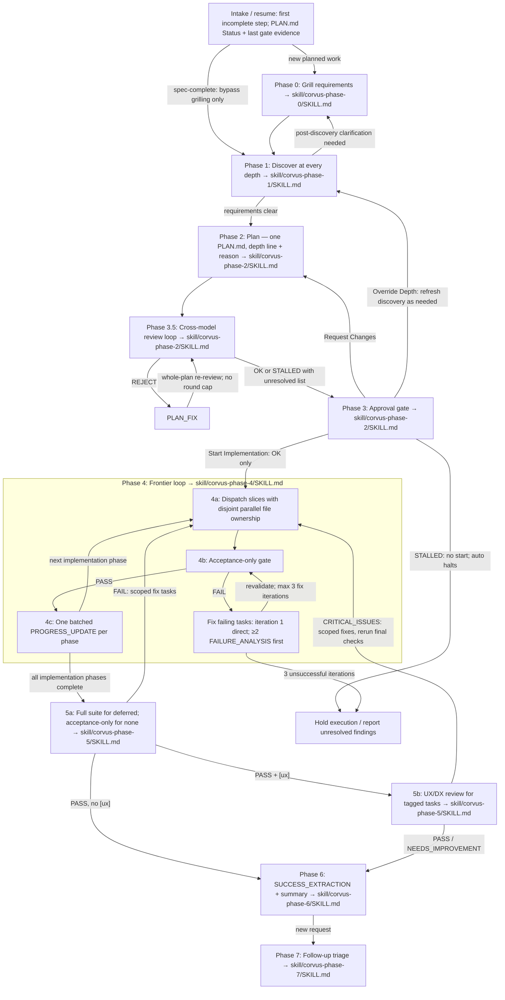

# Corvus State Machine

Navigation map for [Corvus](../agent/corvus.md) and [Corvus Auto](../agent/corvus-auto.md).
Paths in the diagram are repository-relative; phase skills own the procedures and dispatches.
Depth (`quick | standard | deep`) scales effort, never discovery, review, or required gates.

```mermaid
flowchart TD
    I["Intake / resume: first incomplete step; PLAN.md Status + last gate evidence"]
    G["Phase 0: Grill requirements → skill/corvus-phase-0/SKILL.md"]
    D["Phase 1: Discover at every depth → skill/corvus-phase-1/SKILL.md"]
    P["Phase 2: Plan — one PLAN.md, depth line + reason → skill/corvus-phase-2/SKILL.md"]
    R["Phase 3.5: Cross-model review loop → skill/corvus-phase-2/SKILL.md"]
    X["PLAN_FIX"]
    A["Phase 3: Approval gate → skill/corvus-phase-2/SKILL.md"]
    subgraph E["Phase 4: Frontier loop → skill/corvus-phase-4/SKILL.md"]
        T["4a: Dispatch slices with disjoint parallel file ownership"]
        Q["4b: Acceptance-only gate"]
        U["4c: One batched PROGRESS_UPDATE per phase"]
        F["Fix failing tasks: iteration 1 direct; ≥2 FAILURE_ANALYSIS first"]
        T --> Q
        Q -->|PASS| U
        Q -->|FAIL| F
        F -->|revalidate; max 3 fix iterations| Q
        U -->|next implementation phase| T
    end
    V["5a: Full suite for deferred; acceptance-only for none → skill/corvus-phase-5/SKILL.md"]
    W["5b: UX/DX review for tagged tasks → skill/corvus-phase-5/SKILL.md"]
    C["Phase 6: SUCCESS_EXTRACTION + summary → skill/corvus-phase-6/SKILL.md"]
    H["Phase 7: Follow-up triage → skill/corvus-phase-7/SKILL.md"]
    B["Hold execution / report unresolved findings"]
    I -->|new planned work| G
    I -->|spec-complete: bypass grilling only| D
    G --> D
    D -->|post-discovery clarification needed| G
    D -->|requirements clear| P
    P --> R
    R -->|REJECT| X
    X -->|whole-plan re-review; no round cap| R
    R -->|OK or STALLED with unresolved list| A
    A -->|Start Implementation: OK only| T
    A -->|Request Changes| P
    A -->|Override Depth: refresh discovery as needed| D
    A -->|STALLED: no start; auto halts| B
    F -->|3 unsuccessful iterations| B
    U -->|all implementation phases complete| V
    V -->|"PASS + [ux]"| W
    V -->|"PASS, no [ux]"| C
    V -->|FAIL: scoped fix tasks| T
    W -->|PASS / NEEDS_IMPROVEMENT| C
    W -->|CRITICAL_ISSUES: scoped fixes, rerun final checks| T
    C -->|new request| H
```

| Divergence | `corvus` | `corvus-auto` |
|------------|----------|---------------|
| Choices / resume | `question()` for choices and resume selection | Recorded assumptions; deterministic resume; no questions |
| Depth / approval | User may override depth; explicit start after OK | Accept supplied depth or proposal; auto-accept only OK; stalled review halts |
| Git delivery | User handoff only | Local-only default; trusted opt-in renewed on resume; safeguards in [Git Delivery](../agent/corvus-auto.md#git-delivery) |

Legacy `MASTER_PLAN.md` is read-only; use task-planner's `AMEND_PLAN copy-forward` into a fresh PLAN.md for resume or follow-up.
